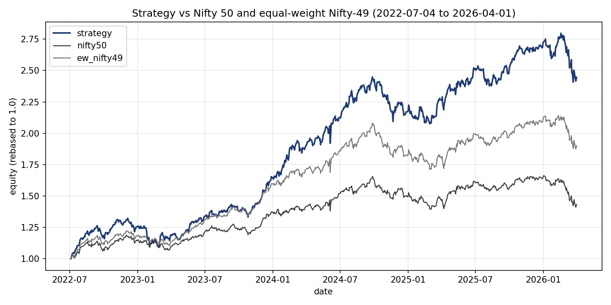
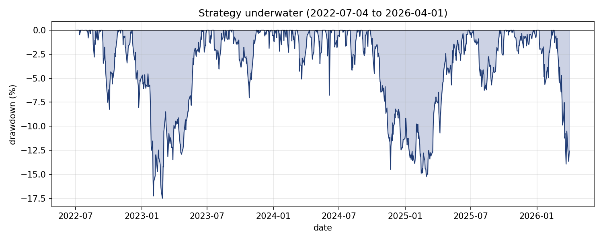
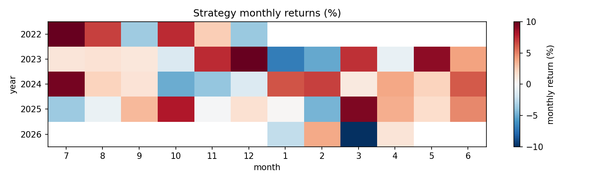

# Phase 4 — Backtest Summary

Phase 4 backtests the v2 LightGBM walk-forward strategy on 49 Nifty-50 tickers (TATAMOTORS excluded) over 2022-07-04 to 2026-04-01 with 47 rebalances. Realistic Indian retail delivery costs and ADV-bucketed slippage are applied per leg.

## 1. Headline

| Metric | Strategy | EW Nifty-49 | Nifty 50 |
|---|---:|---:|---:|
| CAGR | +27.62% | +19.16% | +10.30% |
| Sharpe (rf=6%) | 1.22 | 0.96 | 0.38 |
| Max drawdown | -17.49% | -17.79% | -15.77% |
| **α vs Nifty 50** | **+14.66%** | **+8.03%** | — |
| p(α vs Nifty 50) | **0.003** | **0.000** | — |
| β vs Nifty 50 | 1.05 | 0.98 | — |
| **α vs EW Nifty-49** | **+5.72%** | — | — |
| p(α vs EW Nifty-49) | **0.169** | — | — |
| β vs EW Nifty-49 | 1.09 | — | — |

**vs Nifty 50: +14.66% α (p=0.003).**
**vs equal-weight Nifty-49: +5.72% α (p=0.169).**

The ~8.94% gap between these two alpha figures is the small/midcap effect from universe construction — not the model's signal. The equal-weight Nifty-49 benchmark already outperforms Nifty 50 by +8.03% alpha (p=0.000) from holding the same 49 tickers equally. The marginal contribution of the ML strategy over the right benchmark (equal-weight, same universe, same costs) is +5.72%, directionally positive but not statistically significant at the 10% threshold over 47 rebalances.

All alpha figures are from OLS daily-returns regression with beta control (`alpha_beta_pvalue` in `metrics.py`), not CAGR difference.

---

## 2. Power note

n = 47 rebalances corresponds to roughly 22 independent quarters and ~899 daily return observations. The realized p=0.169 for α vs EW implies a t-statistic of approximately t = 1.38 (computed from `scipy.stats.t.ppf(1 - 0.169/2, df=897)`). Clearing the conventional p=0.05 threshold (two-sided) requires t ≈ 1.96.

The required sample scales as `(1.96 / 1.38)² ≈ 2.03×`. Applied to the current 899 daily observations, that gives a target of ~1,823 observations — approximately 924 additional trading days. At the 20-day rebalance cadence, that translates to roughly 48 additional rebalance periods, or approximately 4 more years of data at the current pace.

At the realized 5.72% point estimate, an additional ~48 rebalance periods (~4 more years at the 20-day cadence) would be required to clear p=0.05. This is a constraint of sample size, not a reason to adjust the test. The power note names the constraint; it does not argue around it.

This calculation assumes the +5.72% point estimate persists in additional out-of-sample data, which is itself the proposition the test cannot yet confirm. The power note describes a sampling constraint, not a forecast.

---

## 3. Methodology validated — walk-forward retraining contributes ~622 bps

The frozen-fold-0 counterfactual (all 47 rebalances forced to use fold 0, trained through 2021-12-28) produces α vs EW of **−0.50%** (p=0.890). The stitched walk-forward produces +5.72%.

The **622 bps gap is what quarterly retraining delivers.** A static model trained in 2021 and held fixed would have produced no alpha over the 2022–2026 backtest window. The architecture decision — retrain every quarter, stitch folds in strict temporal order — is empirically correct.

See `frozen_fold_comparison.md` for the full side-by-side including per-ticker overlap between stitched and frozen-fold picks.

---

## 4. What the model captures — feature-side governance signal

INDUSINDBK was held in **0 of 47 rebalances** under both the stitched walk-forward and the frozen-fold-0 configurations during the Mar-Apr 2025 governance crisis.

Fold 0 was trained through 2021-12-28 — well before the 2025-03-11 incident became visible in market data. The avoidance is consistent across both configurations, which means the v2 features ranked INDUSINDBK below the top-10 cutoff durably across the period, not via memorization or recency. Identifying which features drove the ranking would require feature-importance analysis on the relevant rebalances, which is out of scope for this report.

**Adani disclosure.** The same does not cleanly hold for Adani names. ADANIENT was held 4/47 stitched and 2/47 frozen during the Jan-Mar 2023 Hindenburg window. The model rode the recovery; it did not predict the crash. Net contribution from ADANIENT over the full backtest is +677 bps despite the in-window holds — the post-crash recovery dominates the crisis drawdown. INDUSINDBK avoidance is the singleton clean example from this backtest. The narrower claim is what the evidence supports.

---

## 5. Required disclosures

- **Marginal α vs EW not significant at 10%.** +5.72%, p=0.169 over 47 rebalances.
- **Concentration.** Roughly 50% of attribution-model alpha concentrated in 3 names: BEL +1448 bps, TRENT +768 bps, ADANIENT +677 bps. BEL alone accounts for +14.5% of NAV attribution across the backtest. Removing top-3 counterfactually drops attribution alpha from +11.30% to +5.90%; removing top-10 collapses it to −0.35%.
- **Recency-dependent.** Without quarterly retraining, alpha vs EW drops from +5.72% to −0.50% (frozen-fold-0 counterfactual, p=0.890). All of the 5.72% — and an additional 50 bps of underperformance — comes from the quarterly retraining cadence, not the 2021 feature set alone.
- **TRENT specifically requires recent training.** 22/47 stitched holds vs 5/47 frozen — TRENT is a clear late-period pick that fold 0 does not rank highly.
- **Attribution-baseline alpha (no costs/slippage) is +11.30%.** The ~283 bps gap to the OLS-corrected primary +5.72% is cost drag from 743 executed trades at ~16 bps/leg average.

---

## 6. What the sensitivity sweep reveals

Full table in `sensitivity.md`. Two findings are worth naming separately.

### 6a. n=5 reveals more signal than the default exposes

n=5 selection produces **+15.16% α vs EW at p=0.014** (Sharpe 1.59, CAGR +39.55%). The n=10 default sits at +5.72% (p=0.169).

This is a real finding about what the v2 model can do: at smaller selection sizes, the signal is statistically significant. The n=10 locked spec is a deliberate diversification choice — trading some signal for breadth — not because the signal is absent. A publisher or investor evaluating only the n=10 headline would underestimate the model's demonstrated discriminative ability. The n=5 result is where the model's α first clears the conventional significance threshold under the same cost and methodology framework.

Reference: `sensitivity.md` row `n5`.

### 6b. The cost model is doing real work — freq=5 destroys α via costs

5-day rebalancing produces **316k INR total cost vs 120k INR primary (2.6×)**, and drops α vs EW from +5.72% to +3.43% (~229 bps reduction, p=0.406 — directionally positive but well below significance).

This is the cleanest empirical validation of the cost model in the project. The cost machinery is doing real work, not rounding. Frequent rebalancing is not free in this cost regime; the strategy's edge does not survive 5-day churn.

freq=60 is a viable alternative: similar α (+4.65%, p=0.254), much lower cost (~43k INR), only 16 rebalances over the backtest window. The lower rebalance count explains the weaker p-value despite competitive α — less data than the primary's 47 rebalances.

Reference: `sensitivity.md` rows `freq5` and `freq60`.

### 6c. The rest

Brokerage flip to 20 INR flat per leg (FlatBrokerageDeliveryCosts) is essentially noise: +6.48% α vs EW (p=0.118) compared to primary +5.72% (p=0.169) — within standard error, and the p-value actually worsens slightly because the higher cost total marginally hurts absolute returns. Doubling slippage rates (all 4 ADV buckets ×2) drops α by ~146 bps to +4.26% (p=0.309) — a survivable hit. The strategy is moderately cost-robust within reasonable cost-model variations; the only scenario that materially destroys α is the 5-day rebalance cadence via cost accumulation, not model-parameter drift.

---

## 7. Regime breakdown

Strategy outperformed both benchmarks in 3 of 4 named windows.

| Window | Dates | n days | Strategy | Nifty 50 | EW Nifty-49 |
|---|---|---:|---:|---:|---:|
| Pre-Hindenburg | 2022-07-04 → 2023-01-24 | 141 | +23.32% | +14.42% | +17.53% |
| Hindenburg + Adani | 2023-01-25 → 2023-04-30 | 62 | −2.80% | +0.97% | +2.01% |
| 2024 calm bull | 2024-01-01 → 2024-12-31 | 246 | +32.03% | +8.75% | +13.99% |
| INDUSINDBK + post | 2025-03-01 → 2026-04-01 | 267 | +17.35% | +2.53% | +10.67% |

**The 2024 calm-bull window is where v2 features pay off most decisively.** +32.03% strategy vs +13.99% EW — a +18 percentage-point cumulative gap in a single calendar year. This is consistent with the v1→v2 redesign rationale: the 10 trend-persistence and regime-adjusted features added in Phase 3.5 specifically targeted v1's miscalibration in calm-trending markets. The regime where v1 failed most is the regime where v2 wins most.

**Hindenburg + Adani is the lone loss period.** The model held ADANIENT in 4 rebalances during this window (stitched; 2 in frozen-fold). Strategy fell −2.80% while both benchmarks posted small gains; strategy vol in this window (23.5% annualized) was roughly 2× its calm-bull vol (17.8%), consistent with concentrated positioning into a high-stress period. The post-crisis Adani recovery is what drives the +677 bps net contribution.

See `regime_breakdown.md` for annualized-stats table (CAGR, volatility, MDD per window).

---

## 8. Plots

All three plots generated by `report.py` at 150 DPI. `equity_curve.png` shows both benchmarks; `drawdown.png` shows strategy only; `monthly_returns_heatmap.png` uses a red-blue diverging palette, ±10% clipped.

---

## 9. Methodology integrity

- **Lookahead invariant** `train_end + embargo_days < rebalance_date` held across all 47 rebalances (0 violations). Both the strict version (`train_end < d`) and the embargo-inclusive version (`train_end + 5d < d`) are satisfied at every rebalance.
- **Spot-check at 2024-06-18** reproduced the engine's top-10 picks exactly when fold 9 was reloaded from disk and features recomputed as-of t-1 (2024-06-17). Predicted probability differences were < 5×10⁻⁴ (CSV serialization at 4 decimal places; full-precision differences ~4×10⁻⁵ — pure rounding, not path divergence).
- **All 743 trades landed in the lowest slippage bucket** (5 bps, trade size < 0.1% of 20d ADV). No problematic-trade flags (`n_problematic_trades = 0`).
- **Costs applied per leg** at the expected rate: ~16 bps/leg average (120,496 INR total across 743 trades), matching the `IndianDeliveryCosts` model for a ~100k INR leg on Nifty-50 stocks.
- **Primary α vs EW reproduces deterministically** across runs (no stochastic components in the engine; model `predict_proba` is deterministic from saved fold artifacts).

---

## 10. Implementation notes

**Fractional shares** (research convention): the engine targets exact 100% invested by allowing fractional positions. Whole-share rounding would produce < 0.1% cash drag — negligible compared to the model's IC of 0.034. This is a research-backtest convention and would require rounding adjustments in a live implementation.

**Equal-weight benchmark uses the same universe, same costs, and same slippage** as the strategy. This is deliberate: universe restriction (49 vs 50 tickers, TATAMOTORS excluded) is not free alpha. The EW Nifty-49 result already accounts for identical cost treatment, so the +5.72% marginal alpha is a clean ML-signal estimate, not a cost-differential artifact.

**Walk-forward stitching enforces strict `train_end + embargo_days < rebalance_date`**, where `embargo_days = 5` matches the Phase 3 fold construction. The fold used at each rebalance is the one with the most recent `train_end` satisfying this constraint. At the last rebalance (near 2026-04-01), fold 15 (trained through 2025-09-26) is the active fold.
